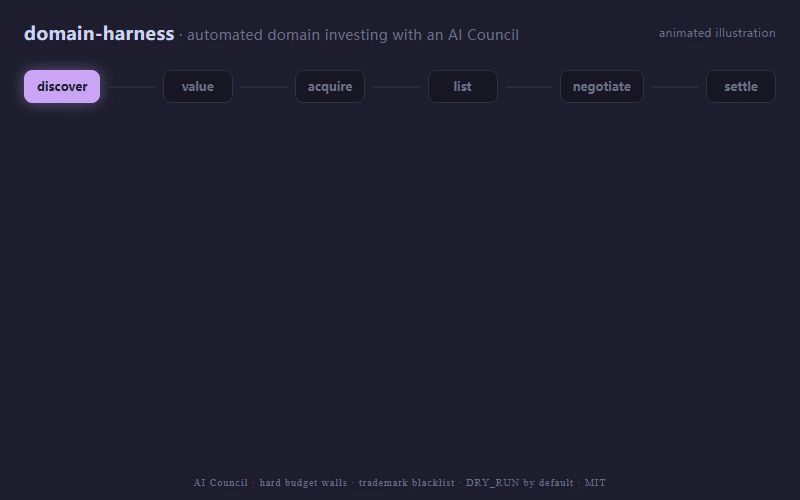
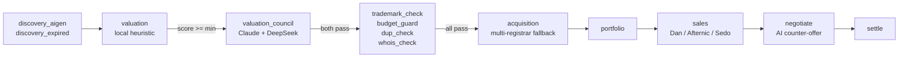

# domain-harness

[](https://github.com/lfzds4399-cpu/domain-harness/actions/workflows/test.yml)
[](https://www.python.org/downloads/)
[](./LICENSE)
[](#configuration)

> 中文版 → [README.zh-CN.md](./README.zh-CN.md) · Docs → [getting-started](./docs/getting-started.md) · [FAQ](./docs/faq.md) · [troubleshooting](./docs/troubleshooting.md)



**Automated domain investing pipeline.** Discover → value → register → list → settle —
with hard budget walls and an AI Council that has to agree before any money moves.

```
discover  ─►  value  ─►  acquire  ─►  list  ─►  negotiate  ─►  settle
   │           │           │           │           │
   AI gen +    local +     multi-     Dan /        AI reply
   expired     AI Council  registrar   Afternic    + counter
   feeds       (Claude     fallback   Sedo
               + DeepSeek)
```

## What it does

- **Two-tier valuation** — local heuristic gates filter candidates before any AI call. Survivors only are billed to the AI Council.
- **AI Council** — shortlisted candidates are scored by Claude and DeepSeek independently. Both must clear a per-provider threshold before the harness will spend.
- **Hard budget walls** — daily cap, monthly cap, per-domain cap, reserve floor. If any one trips, the loop stops before any registrar call.
- **Multi-registrar fallback** — Porkbun → Cloudflare → Namecheap → GoDaddy by priority. If one rejects, the next tries.
- **Trademark blacklist** — built-in list plus user blacklist; rejects names like `mygoogle.com` before valuation.
- **25-case end-to-end smoke** — `tests/e2e_smoke.py` exercises every spend gate in DRY_RUN mode without touching a wallet. CI runs it on every push.

## Architecture



## Sample output

```
$ python cli.py status

mode:        dry_run
daily cap:   $50
monthly cap: $1000
holdings:    0 domains
spent:       $0 today, $0 this month
watchlist:   0
```

```
$ python tests/e2e_smoke.py

[1] 配置 import          ✓ 配置加载
[2] valuation 分数边界    ✓ pay.com 高分（字典词）
                         ✓ zuvow.com 受 hard cap 抑 40 分
                         ✓ go.ai 短品牌通过
                         ✓ 长域名+多字符 -25 分惩罚
[3] 商标黑名单           ✓ mygoogle.com 拦截
                         ✓ openai-clone.ai 拦截
                         ✓ paywall.com 通过（非商标）
[4] WHOIS 检查           ✓ 注册过的域名识别（google.com）
[5] 预算守卫硬刹车        ✓ 单域名超过返回拦截（$200 > $15）
                         ✓ 正常金额通过（$10）
[6] 重复购买检查          ✓ 空持仓时 dup_check 不抛异常
[7] DRY_RUN 注册          ✓ acquisition.buy DRY_RUN
                         ✓ 写入 portfolio.owned
                         ✓ 写入 budget_state（spent +10）
[8] 二次买入应被拦        ✓ 再次 buy 抛 DuplicateError
[9] 挂牌定价             ✓ list_for_sale DRY_RUN
                         ✓ 挂牌后 portfolio 有 listed_price_usd
[10] AI 议价（无 key 时降级）  ✓ negotiate_reply 返回 counter_offer
[11] 清理测试数据         ✓ 清掉测试域名

汇总：25 PASS / 0 FAIL/ERROR / 共 25
```

## Install

Requires Python 3.10+.

```bash
git clone https://github.com/lfzds4399-cpu/domain-harness.git
cd domain-harness
pip install -r requirements.txt
cp .env.example .env       # fill in only what you use
```

## Run

```bash
# Status snapshot (mode, budget, holdings, watchlist)
python cli.py status

# One scan pass (generate candidates → value → push to watchlist)
python cli.py scan --target 30

# Watchlist top N
python cli.py watchlist --top 10

# Single-domain appraisal (with optional AI Council)
python cli.py appraise example.com

# Offline backtest — Monte Carlo over a candidate pool
python cli.py simulate --pool 200 --top 20

# Manual buy with confirmation (DRY_RUN; flip mode in manifest.yaml)
python cli.py buy somedomain.com --price 9.13

# Run end-to-end smoke
python tests/e2e_smoke.py
```

The harness defaults to **`mode: dry_run`** in `manifest.yaml`. Flip to `live` only after you've seeded keys and reviewed the budget block.

## Configuration

`manifest.yaml` is the single source of truth:

| section | what it controls |
|---|---|
| `budget` | daily / monthly / per-domain caps and reserve floor |
| `tld` | whitelist + per-TLD priority weight + blacklist |
| `valuation` | score thresholds, length limits, commercial-signal hard gate |
| `registrars` | enable + per-registrar priority |
| `sources` | AI generation patterns + expired-domain feeds |

Secrets stay in `.env` — see [`.env.example`](./.env.example).

## Architecture (filesystem)

```
domain-harness/
├── manifest.yaml           # all knobs
├── cli.py                  # entrypoint (status / scan / appraise / buy / simulate / manifest)
├── core/                   # config / store / log / manifest
├── validators/             # budget_guard / dup_check / whois_check / trademark_check
│                           # secret_scanner / cost_tracker
├── agents/                 # discovery_aigen / discovery_expired
│                           # valuation / valuation_council / acquisition / sales
├── pipelines/              # daily_scan / auto_register / portfolio_review
├── simulate/               # backtest + Monte Carlo report
├── tests/                  # e2e_smoke (25 cases, DRY_RUN)
├── data/                   # runtime state (gitignored)
└── logs/                   # daily logs (gitignored)
```

## Disclaimer

**This is not financial advice.** Domain investing involves real financial risk, including total loss of capital spent on registrations and renewals. Most speculatively-registered domains never resell.

This tool automates spending decisions. Once `mode: live` is set in `manifest.yaml` and registrar API keys are configured, it will spend real money against your registrar accounts subject to the configured budget caps. The budget walls are hard (the loop stops when a cap trips) but they do not guarantee profit — they only bound the loss.

Before flipping to `live`:

- Read `manifest.yaml` end to end.
- Run `python tests/e2e_smoke.py` and confirm 25 PASS.
- Start with a daily cap small enough that you can lose it entirely without consequence.
- Verify your registrar account balances and auto-renew settings independently of this tool.

The author runs no guarantee of correctness, profit, or suitability. Use at your own risk.

## Contributing

See [CONTRIBUTING.md](./CONTRIBUTING.md). The bar is: every spend gate must be exercised by a smoke case.

## License

MIT — see [LICENSE](./LICENSE).
